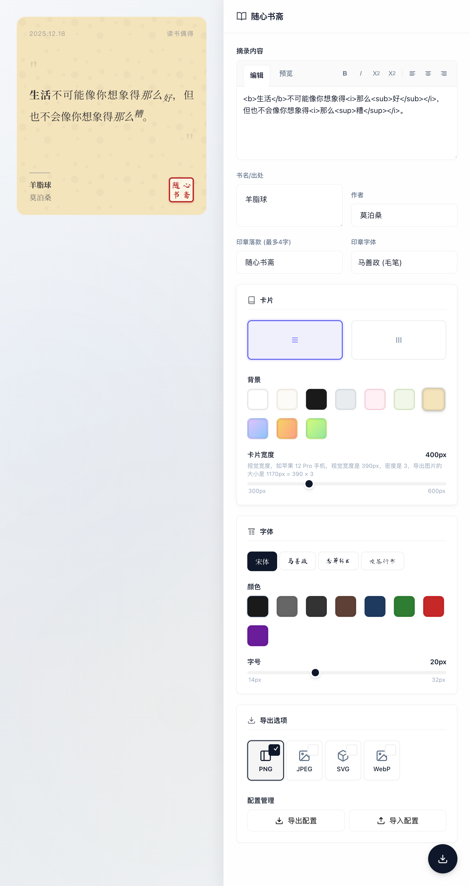
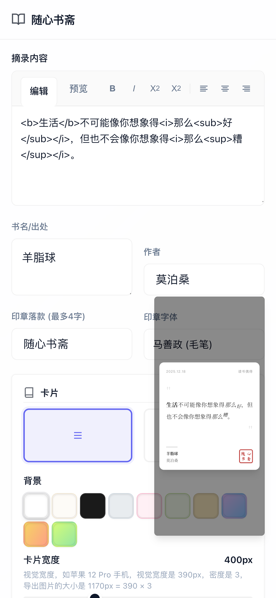
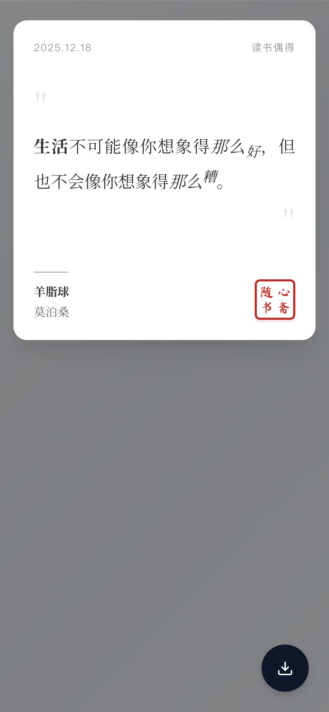

# 书摘卡片生成器

一个简单易用的书摘卡片生成工具，可以快速生成精美的书摘图片。

## 预览截图

### 桌面端预览



### 移动端预览





## 功能特性

- 📝 **实时预览**：输入内容后实时预览效果
- 🎨 **多种主题**：内置 10+ 精美主题，包括纯色和渐变背景
- 🔤 **字体选择**：支持多种中文字体，包括宋体、毛笔字体、行书字体等
- 🎯 **布局切换**：支持横排和竖排两种布局方式
- 📱 **响应式设计**：完美适配桌面端和移动端
- 💾 **一键导出**：支持导出为高清 PNG 图片
- 🎨 **自定义样式**：可调整字体大小、颜色、卡片宽度等

## 使用方法

1. 在输入框中填写：
   - **摘录内容**：要展示的文字内容
   - **书名/出处**：书籍名称或来源
   - **作者**：作者姓名
   - **印章落款**：印章文字（最多4字）

2. 自定义样式：
   - 选择主题背景
   - 选择字体和字号
   - 选择字体颜色
   - 调整卡片宽度
   - 切换横排/竖排布局

3. 预览和导出：
   - 在预览区域实时查看效果
   - 点击"保存"按钮导出为 PNG 图片

## 技术栈

- HTML5
- CSS3（使用 CSS 变量和 Flexbox）
- JavaScript（ES6+）
- html2canvas（用于图片导出）

## 文件结构

```
book-excerpt-generator/
├── index.html      # 主页面
├── script.js       # 核心逻辑
├── style.css       # 样式文件
├── README.md       # 说明文档
└── screenshots/    # 截图目录
    ├── desktop.png # 桌面端预览截图
    ├── mobile-1.png # 移动端预览截图 - 编辑界面
    └── mobile-2.png # 移动端预览截图 - 全屏预览
```

## 浏览器支持

- Chrome/Edge（推荐）
- Firefox
- Safari
- 移动端浏览器

## 许可证

MIT License
